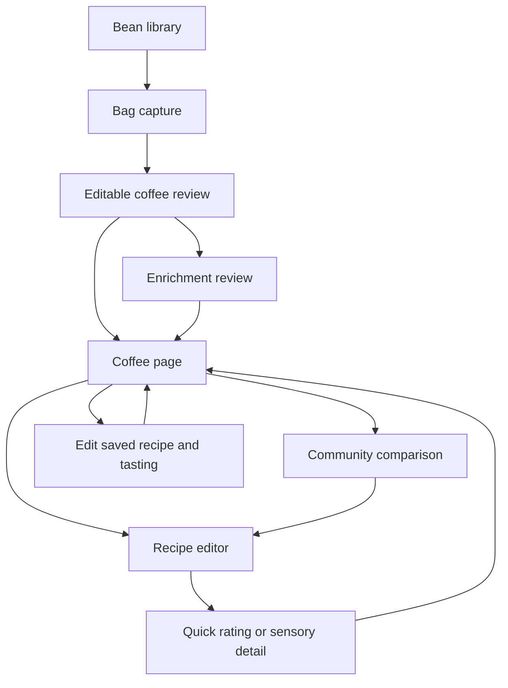

# MVP flow map

## Screen inventory

| Screen | Entry | Main actions / destination |
| --- | --- | --- |
| Bean library | Beans navigation; starting screen | Open coffee; Scan a coffee bag |
| Scan front | Scan a coffee bag | Capture sample front → scan back |
| Scan back | Front captured | Capture sample back → review |
| Coffee review | Scan complete; manual entry | Edit fields; find more details; save bag details only |
| Enrichment review | Find more coffee details | Review source additions → add coffee to shelf |
| Coffee / Brews | Open coffee | New brew; edit saved tasting; brew again |
| Coffee / Details | Details section | Inspect coffee information |
| Coffee / Community | Community section | Filter brewer; compare score/profile; try example recipe |
| Recipe editor | New brew; Brew again; editing Recipe tab | Adjust settings; manage pours; continue to tasting or save edits |
| Quick rating | Continue to tasting; Edit tasting | Overall /100; Acidity, Body, Aftertaste; tags; notes; save |
| Sensory detail | Sensory detail choice | Expand attributes; same overall score; save |
| Journal | Journal navigation | Browse brews; Edit tasting; Brew again |
| Gear | Gear navigation | Change default brewer/grinder |

## Primary routes

## Walkthroughs

### Capture a coffee

Beans → Scan a coffee bag → Use sample front photo → Use sample back photo → review/correct information → Find more coffee details → Add coffee to shelf.

Photos and web additions are simulated in this reference. Production capture and matching are specified separately.

### Record a brew

Beans → Hamasho → New brew → adjust temperature or grind → manage pours → match water total if required → Continue to tasting → enter overall score and three quick attributes → Save brew & tasting.

### Expand the tasting

At tasting, change an Acidity, Body or Aftertaste value → switch to Sensory detail → confirm the same value → add other attributes → switch back → confirm the overall score and shared values remain intact.

### Edit a saved brew

Hamasho / Brews → Edit tasting → change score, attributes, tags or notes → optionally Recipe tab to adjust recipe → Save changes. The same entry changes; no additional brew is created.

To verify cancellation: edit a value → Cancel changes → reopen the saved brew. Its previously saved values remain.

### Dial in another brew

Saved brew → Brew again → change one setting → note the displayed change → Continue to tasting → Save brew & tasting. This creates an additional brew.

### Compare

Hamasho → Community → inspect overall /100 and Acidity/Body/Aftertaste comparisons → filter brewer → optionally Try this recipe. Community data here is illustrative.

## Review viewports

The reference is a phone-sized surface with a maximum width of 430 px. Inspect the application at 360, 390, and 430 px wide, and check long labels at 320 px. Larger browser windows center the mobile interface.
